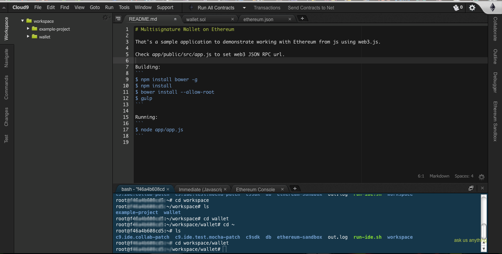

#Ether.camp Studio IDE docs (beta)

Welcome to Ether.camp Studio. Studio is your online Dapp Integrated Development Environment (IDE) for the  Ethereum blockchain. If you are new to Ethereum smart contracts and developing applications, you've have come to the right place. If you already have an idea for a smart contract and you want to develop a web front end to launch: then you in the right place read on..

What you need: Sign on to https://live.ether.camp/signup and come back to follow along this guide. Once you log in, familiarize yourself with the interface. It is based on the cloud9 online IDE. Yours maybe in a different color. Not to worry, you adjust your colors by selecting the cloud9 menu -preferences-themes

 

