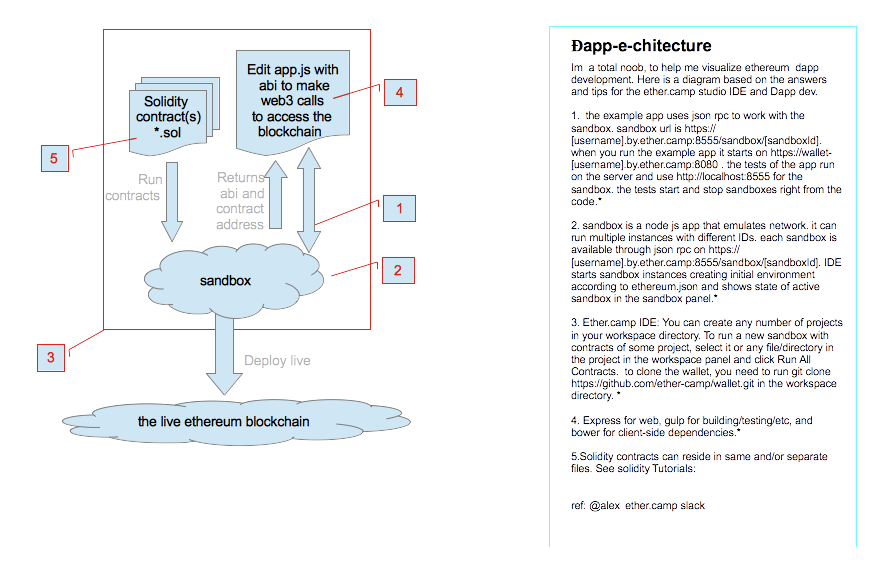

# Đapp-e-chitecture

Dapp structure is a node.js express framework with a web3.js module to interact with the Ethereum blockchain. The front-end can be vanilla html/css/js or any MVC framework of your choice. Data storage on the Ethereum blockchain is still too expensive to use the blockchain as a full backend. Decentralized storage implementations do exist (IPFS and Swarm). However it is beyond the scope of this documentation. IPFS may be featured in the Advanced section at a later date. Meanwhile, [Dapps for beginners](https://dappsforbeginners.wordpress.com/tutorials/your-first-dapp/) is a good intro to Dapp development. 

The heart and soul of Dapps on Ethereum are the smart contracts that form the business logic of your applications. Ethereum Studio IDE can provide the tools needed to develop, run and integrate smart contracts into your web applications. 

With Ethereum Studio,  the steps are as follows: 
Write and run your contract [5]. A API json is created in the sandbox[2]. Edit this ABI json object into your app.js [4]. Your app.js will be able to read/write [1] access to the contract on the blockchain[2].

