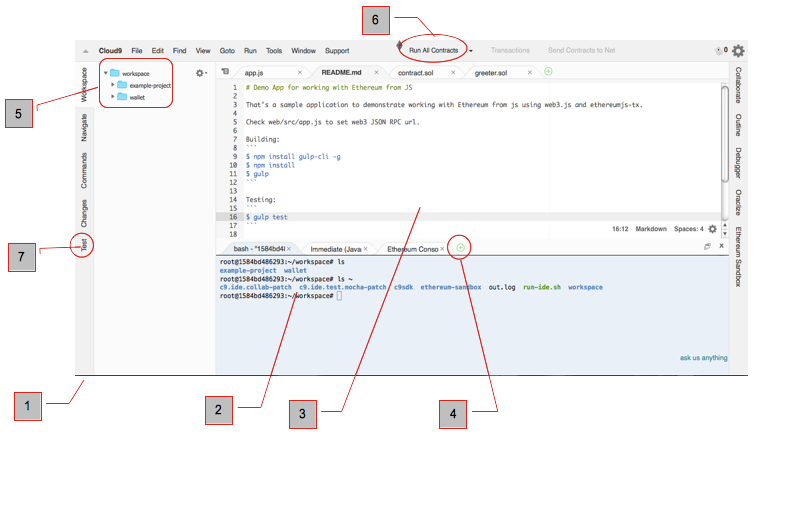

# Ethereum Studio IDE

Anatomy of the IDE
1.  Your IDE screen: Once logged into Ethereum Studio, you can adjust the screen colors  to suit your visual comfort via the Cloud9 menu -preferences-themes.
2.  Unix terminal Bourne Shell (BASH), with npm and basic Unix commands. The Studio IDE is running on a remote Ubuntu computer. It's your Linux computer accessible from any browser. You can issue [standard Unix commands](http://freeengineer.org/learnUNIXin10minutes.html), install npm node.js modules and [sync with github](https://docs.c9.io/docs/setting-up-github-workspace) repositories.
3.  Configurable tabbed editor screen compatible with standard code editors. Features full syntax highlighting (Solidity, javascript and all popular languages).
4.  Click to open a new terminal console, new file, new run configuration or new window.
5.  Your workspace directories. Here we see two separate projects. You can have multiple projects in your workspace. Just change directories (cd ~/[project directory name]
6.  Run all contracts/run active contracts buttons: use to run all your contracts in your curret directory. Or use 'run active contracts' to run only the opened contracts .sol code in the text editor [3.]
7.  Mocha testing button. (see testing section later).

