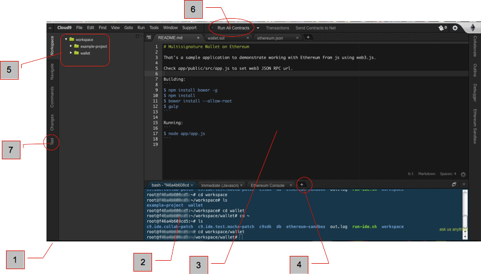

# IDE work flow

1. Once logged into Ethereum Studio, the screen colors can be ajusted to suit your visual confort. This one is the midnight theme to reduce glare. Colors can be ajusted via the Clud9 menu -preferences-themes.
2.  Unix terminal Bourne Shell (BASH), with npm and basic Unix commands. The Studio IDE is running on a remote Ubuntu computer. It's your Linux computer accessible from any browser. You can issue standard Unix commands, run npm and access github repositories.

