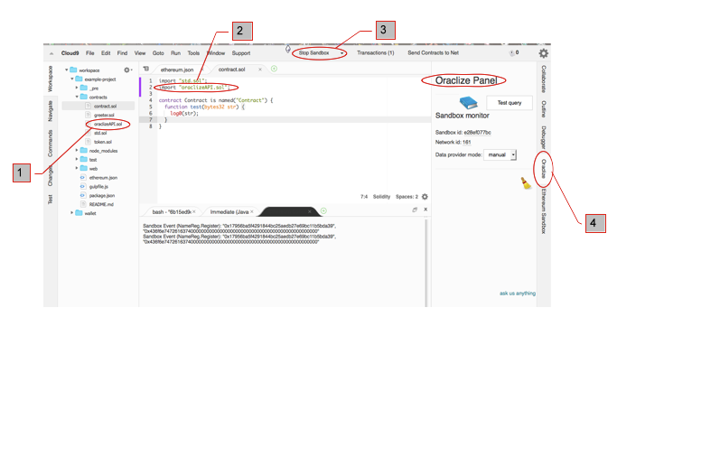
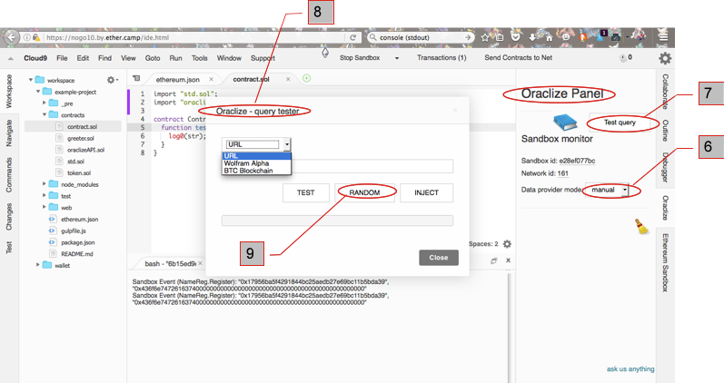

# Oraclize in Ethereum Studio

Yes, now you can use Oraclize directly from within Ethereum Studio's IDE. Detailed instructions can be found in the Ether.Camp [blog article](http://blog.ether.camp/post/145202667083/ethereum-studio-integrates-oraclize). The following screenshots will show you complementary info to get you started in the IDE.



1.The Oraclize [github example](https://github.com/ether-camp/oraclize-example/blob/master/ethereum.json) tells where to edit the ethereum.json to include the plugin config (see item [1] in screenshot above). 

2.Then copy the [oraclizeAPI.sol]( oraclize-example/contracts/lib/oraclizeAPI.sol ) source to your contracts folder [2]. 

3.Edit your project contract Solidity file to 'import' the oraclizeAPI.sol (see item [3] in screenshot above).-make sure the folder path corresponds to your project's contract folder location. If you keep a libs folder for imported .sol files eg. then ```import "lib/oraclizeAPI.sol";``` In the workspace above it's simply ```import "oraclizeAPI.sol";``` since the contract and the imported .sol are in the same folder.

4.You may run your project contract.sol [4]

5.Note the new plugin tab . Click on that and the Oraclize panel appears.  and 

6.Now you can test queries in either manual or live mode (auto)

7.Click on 'Test query' 

8.and a pop up appears allowing you try out Oraclize with a specific URL, Wolfram formula, or BTC blockchain queries.

9.Try 'Random', and surprise yourself with the possibilities of this awesome utility in your Dapps.


