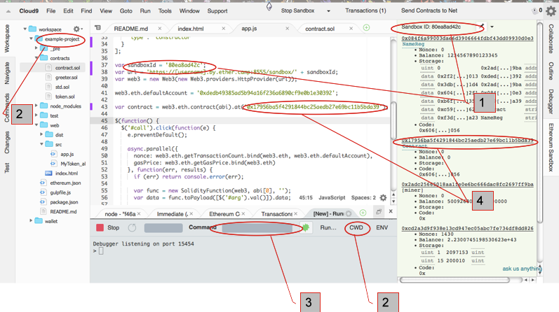

# Running your app

Once you have sandbox running you can run your app. But,** first configure some things correctly**. 



You need to make sure your app has the correct JSON-RPC URL of your sandbox (or livenet node). In the example /workspace/example-project/web/app.js file, edit the lines.

## 


[1] **Set the correct SandboxID#:**

```var sandboxId = '[somenumber]';
var url = 'http://' + window.location.hostname + ':8555/sandbox/' + sandboxId;
var web3 = new Web3(new Web3.providers.HttpProvider(url));```

change to

```var sandboxId = '[your_running_sandboxID#]';
var url = 'https://[username].by.ether.camp:8555/sandbox/' + sandboxId;
var web3 = new Web3(new Web3.providers.HttpProvider(url));```


## 


**AND in line below**


## 


**Set the correct Sandbox URL:**

```var url = 'https://' + window.location.hostname + ':8555/sandbox/' + sandboxId;```

change to

```var url = 'https://[your_username].by.ether.camp:8555/sandbox/' + sandboxId;```


## 


**Check and edit your ABI as needed**

In the /workspace/example-project/web/app.js file has a Array definition ABI =[ ....  ]
Remember to check that its content corresponds to the ABI json in the sandbox (or livenet) contract address you deployed (see Sandbox panel section).

**Check your contract addresses**
[4] If your app refers to specific contracts running the sandbox, check the addresses listed in your app.

### Get Ethereum Studio ready:


[2] and [3] In the terminal change your current directory to the project folder you want to run. When running, in case of error, check the CWD (Change Working Directory) button and pick the project directory.
