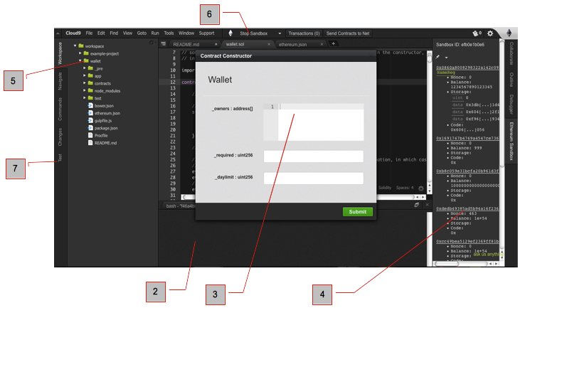

# Sandbox features

'Sandbox' is a node js module that emulates the ethereum network. Once you have a solidity contract code written and saved with .sol suffix, you can run the contract (deploy)it to the sandbox for testing.

1. Shown here is the screen an example: the wallet.sol multi signature wallet solidity contract. 
2. Ethereum console shows the output log of transactions
3. The pop-up appears when we run the sandbox (see item #6). The pop-up is the contract constructor for the contract owner (you) to set the parameters
