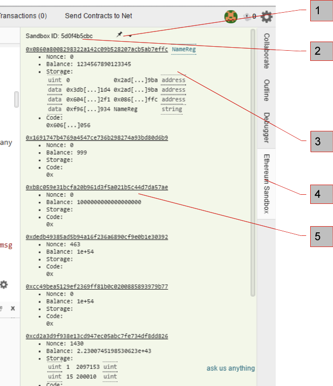

# Sandbox panel

'Sandbox' is a node js module that emulates the ethereum network. Once you have a contract written, run a it and, the Sandbox panel appears on the right side of the screen. The panel presents the addresses of accounts and contracts on the blockchain generated from your ethereum.json at the root fo the proejct folder:

[1] This pin enables you to lock the Sandbox ID# so you don't have to edit your app.js each time you run your contract(s).

[2] SandboxID#. Each time you start the sandbox, a new SandboxID is generated. Before you can view your app in your browser, you must verify that the app.js file has the correct sandboxID listed. If you don't want the SandboxID to change, pin it  (see note 1)

[3] 