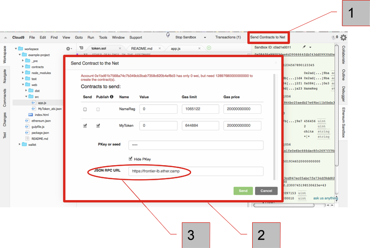

# Send contract to the net

You can 'Send contracts to the net' by using the button on the top menu tool bar [1] above the Sandbox panel. Doing so will bring a pop-up [2]





Note the message Account 0x..d3 has zero wei and the JSON RPC URL [3] is set to ```https:frontier-lb.ether.camp```. That's because you need to pay for the transaction gas needed with real ether. For testing purposes replace the JSON RPC URL with the morden testnet URL ```morden-lb.ether.camp```

Now in a web browser go to [morden.ether.camp](morden.ether.camp) and click the 'Get Address' button on the toolbar.