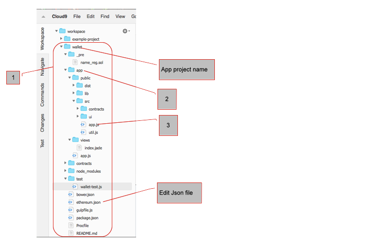

# Example projects


Out of the box, Studio has a very basic example project you can copy to a new project folder and edit to get going on your project. Example app demonstrate working with Ethereum from javascript using web3.js and ethereumjs-tx. Edit the web/src/app.js to check the web3 JSON RPC url.

Or you can study the Wallet app example which is more suitable for production.  In the terminal type: 

```
cd ~/workspace 
git clone https://github.com/ether-camp/wallet.git``` 
  
Which loads a copy of the Wallet.app [1] into your workspace directory:




The app directory [2] with app.js [3], the main application javascript file. The______ file must be edited to ensure running sandbox and javascript files are pointed to the correct ports.


